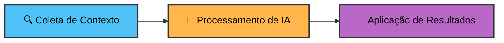

## Passo 2: Compondo Workflows de IA

Ótimo trabalho! Seu primeiro workflow de IA agora está funcional. Em seguida, vamos ver como combinar a action `ai-inference` com outr   **Exemplo de corpo:**<details>
<summary>Tendo problemas? 🤷</summary><br/>

- Se o workflow não executou, confirme que:
  - o workflow está no diretório `.github/workflows`
  - o trigger é `issues: [opened]` e você criou uma nova issue (não editou uma existente).
- Se o workflow falhou ao fazer parse, verifique se a indentação YAML está correta e se todos os campos obrigatórios estão presentes.
- Se o workflow falhou por qualquer motivo, por exemplo, porque estava incompleto ou formatado incorretamente, você precisará corrigi-lo e então abrir outra issue para acionar o workflow novamente.

</details>rkdown
   Recebendo erros 500 quando tento fazer login no meu telefone. Funciona às vezes mas nem sempre.
   ```

1. Conforme você cria a issue, observe seu workflow rodando na aba **Actions**.
1. Quando o workflow for concluído, você deve ver um novo comentário na issue com a análise de IA da issue.

<details>
<summary>Tendo problemas? 🤷</summary><br/>

- Se o workflow não executou, confirme que:
  - o workflow está no diretório `.github/workflows`
  - o trigger é `issues: [opened]` e você criou uma nova issue (não editou uma existente).
- Se o workflow falhou ao fazer parse, verifique se a indentação YAML está correta e se todos os campos obrigatórios estão presentes.
- Se o workflow falhou por qualquer motivo, por exemplo, porque estava incompleto ou formatado incorretamente, você precisará corrigi-lo e então abrir outra issue para acionar o workflow novamente.

</details>ar workflows de IA significativos para seus projetos.

### 📖 Teoria: Compondo Workflows de IA

A IA adiciona mais valor no Actions quando você conecta três processos sequenciais para criar automação inteligente:



Veja como esse padrão de workflow funciona:

1. **🔍 Coleta de Contexto**: Use GitHub Actions para coletar dados do [contexto de eventos](https://docs.github.com/en/actions/learn-github-actions/contexts#github-context), conteúdo de arquivos, resultados de API ou saídas de passos anteriores do workflow
1. **🤖 Processamento de IA**: Alimente o contexto coletado na `actions/ai-inference` com um [system prompt](https://github.com/actions/ai-inference#system-prompts) focado que define o papel da IA e o formato de saída esperado.
1. **🚀 Aplicação de Resultados**: Use a resposta da IA como entrada para outra action que cria mudanças significativas como postar comentários, atualizar arquivos ou criar notas de release

Este padrão de três passos mantém os workflows sustentáveis enquanto automatiza tarefas que requerem julgamento e que seriam difíceis de script com lógica tradicional.

### ⌨️ Atividade: Crie um workflow automatizado de análise de issues com IA

Vamos construir um workflow que analisará automaticamente issues recém-criadas do GitHub, fornecendo feedback imediato sobre informações faltando, sugerindo melhorias e fazendo perguntas de esclarecimento.

Seguiremos o padrão de três passos: coletando contexto de eventos de issues, processando com IA e postando resultados como comentários.

1. Crie um novo arquivo de workflow chamado:

   ```text
   issue-completeness.yml
   ```

1. Adicione os metadados do workflow e as permissões

   ```yaml
   name: Issue Completeness

   on:
     issues:
       types: [opened]

   permissions:
     models: read
     issues: write
   ```

   Este workflow será executado sempre que uma nova issue for aberta com as permissões para acessar GitHub Models e para escrever novos comentários em issues.

   > ❗ **Atenção:** Copie o conteúdo conforme fornecido, pois este nome exato do workflow (`Issue Completeness`) é necessário para progredir para os próximos passos deste exercício.

1. Agora vamos criar um job que usa a action de inferência de IA.

   Neste cenário queremos analisar o conteúdo da issue para fornecer feedback inteligente e recomendações:

   O GitHub Actions automaticamente nos fornece [contexto rico](https://docs.github.com/en/webhooks/webhook-events-and-payloads?actionType=opened#issues) através do objeto `github.event` sempre que uma issue é aberta. Isso inclui o título da issue, conteúdo do corpo e informações do autor—exatamente os dados que a `ai-inference` precisa para fornecer análise inteligente.

   ```yaml
   jobs:
     analyze:
       name: AI Issue Completeness
       runs-on: ubuntu-latest
       steps:
         - name: Analyze issue with AI
           id: ai-response
           uses: actions/ai-inference@v2
           with:
             token: ${{ secrets.GITHUB_TOKEN }}
             max-tokens: 1000
             system-prompt: |
               Você é um assistente de issues do GitHub. Sua tarefa é analisar issues recém-abertas para completude.

               Forneça sugestões concisas e úteis, faça perguntas de esclarecimento e identifique qualquer informação faltando que ajudaria a resolver a issue mais rapidamente.

               Sempre responda com conteúdo markdown pronto para usar (sem blocos de código) que pode ser postado diretamente como um comentário da issue.

               Assine como assistente de IA.
             prompt: |
               Nova issue foi aberta por ${{ github.event.issue.user.login }}
               Título: ${{ github.event.issue.title }}
               Corpo:
               ---
               ${{ github.event.issue.body }}
               ---
   ```

   > 🪧 **Nota:** O parâmetro **`max-tokens`** é usado para controlar o comprimento máximo da resposta. Valores baixos podem significar que a resposta é cortada pela metade.

1. Agora vamos adicionar um step que postará o comentário da issue usando a saída `response` da `ai-inference`:

   ```yaml
   - name: Comment results on the issue
     uses: peter-evans/create-or-update-comment@v4
     with:
       token: ${{ secrets.GITHUB_TOKEN }}
       issue-number: ${{ github.event.issue.number }}
       body: ${{ steps.ai-response.outputs.response }}

   ```

   > ⚠️ **Importante:** Certifique-se de que este step esteja adequadamente indentado no mesmo nível do step anterior. Ambos os steps devem estar no mesmo nível de indentação sob a seção `steps:`.

1. E pronto! Faça commit do arquivo diretamente na branch `main`, então abra a aba **Actions** e confirme que o workflow aparece.

<details>
<summary>Tendo problemas? 🤷</summary><br/>

- Se a action não aparece na aba **Actions**, verifique se você a colocou no diretório `.github/workflows/` com extensão `.yml`

</details>

### ⌨️ Atividade: Teste o workflow

1. Navegue até a aba Issues e clique em **New issue**.
1. Crie uma issue com qualquer título e corpo que desejar, ou use estes exemplos:

   **Exemplo de título:**

   ```text
   Formulário de login retornando erros 500 no mobile
   ```

   **Exemplo de corpo:**

   ```markdown
   Recebendo erros 500 quando tento fazer login no meu telefone. Funciona às vezes mas nem sempre.
   ```

1. Conforme você cria a issue, observe seu workflow rodando na aba **Actions**.
1. Quando o workflow for concluído, você deve ver um novo comentário na issue com a análise de IA da issue.

<details>
<summary>Tendo problemas? 🤷</summary><br/>

- Se o workflow não executou, confirme que:
  - o workflow está no diretório `.github/workflows`
  - o trigger é `issues: [opened]` e você criou uma nova issue (não editou uma existente).
- Se o workflow falhou ao fazer parse, verifique se a indentação YAML está correta e se todos os campos obrigatórios estão presentes.
- Se o workflow falhou por qualquer motivo, por exemplo, porque estava incompleto ou formatado incorretamente, você precisará corrigi-lo e então abrir outra issue para acionar o workflow novamente.

</details>   ```

   > ⚠️ **Importante:** Certifique-se de que este step esteja adequadamente indentado no mesmo nível do step anterior. Ambos os steps devem estar no mesmo nível de indentação sob a seção `steps:`.

1. E pronto! Faça commit do arquivo diretamente na branch `main`, então abra a aba **Actions** e confirme que o workflow aparece.

<details>
<summary>Tendo problemas? 🤷</summary><br/>

- Se a action não aparece na aba **Actions**, verifique se você a colocou no diretório `.github/workflows/` com extensão `.yml`

</details>

### ⌨️ Atividade: Teste o workflow

1. Navegue até a aba Issues e clique em **New issue**.
1. Crie uma issue com qualquer título e corpo que desejar, ou use estes exemplos:

   **Exemplo de título:**

   ```text
   Formulário de login retornando erros 500 no mobile
   ```

   **Body example:**

   ```markdown
   Getting 500 errors when trying to log in on my phone. It works sometimes but not always.
   ```

1. Conforme você cria a issue, observe seu workflow rodando na aba **Actions**.
1. Quando o workflow for concluído, você deve ver um novo comentário na issue com a análise de IA da issue.

<details>
<summary>Having trouble? 🤷</summary><br/>

- If the workflow didn’t run, confirm that:
  - the workflow is in `.github/workflows` directory
  - the trigger is `issues: [opened]` and you created a new issue (not edited an existing one).
- If the workflow failed to parse, check that the YAML indentation is correct and that all required fields are present.
- If the workflow failed for any reason, e.g because it was incomplete or incorrectly formatted, you will need to fix it and then open another issue to trigger the workflow again.

</details>
